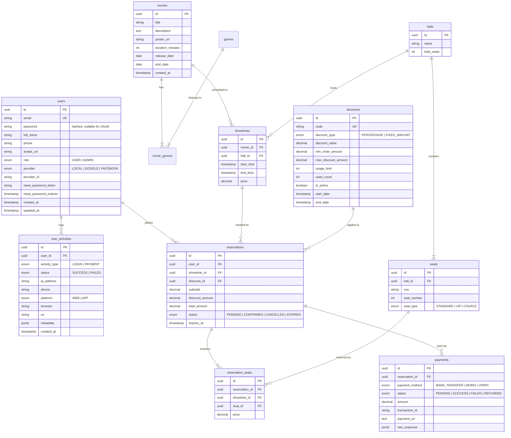

# 🎬 Movie Ticket Reservation System (Backend)

[](https://nestjs.com/)
[](https://www.postgresql.org/)
[](https://typeorm.io/)
[](https://redis.io/)
[](https://www.rabbitmq.com/)
[](https://www.docker.com/)
[](https://www.typescriptlang.org/)

An enterprise-grade, high-throughput backend system for movie theater reservations built with **NestJS**, **PostgreSQL**, **Redis**, and **RabbitMQ**. Engineered using **Clean Architecture** and **Event-Driven Architecture (EDA)** principles to resolve industry-standard challenges: race condition handling (double booking), automated 10-minute seat holding, multi-provider authentication, client security audit logging, discount engine, and box office lifetime reporting.

---

## 🌟 Key Architectural Highlights

* 🛡️ **Race Condition Mitigation & Seat Holding (Level 2 - Cinema Grade)**:
  * **Redis Distributed Locking (`SETNX` with TTL)**: Prevents millisecond-level ticket collision when multiple users contend for high-demand seats simultaneously.
  * **RabbitMQ Dead Letter Exchange (DLX) & TTL**: Automatically releases held seats and expires unpaid reservations after 10 minutes without heavy cron database scanning.
  * **Database-Level Protection**: Pessimistic locking (`SELECT FOR UPDATE`) and composite unique constraints `UNIQUE(showtime_id, seat_id)` ensuring strict ACID compliance.
* 🐰 **Event-Driven Message Bus (RabbitMQ)**:
  * Decouples heavy third-party I/O (login alerts, password reset emails, booking confirmation tickets) from the main HTTP request loop using Topic Exchanges and Manual Message Acknowledgment (`ack`/`nack`).
* 🔐 **Robust Authentication & RBAC**:
  * **3 Authentication Strategies**: Local (Bcrypt + JWT), Google OpenID Token verification, and Facebook Graph API integration with automated account provisioning.
  * **Role-Based Access Control**: Decorator-driven authorization (`@Roles(UserRole.ADMIN)`) with automatic database bootstrapping for system administrators.
  * **Cryptographic Password Recovery**: 256-bit entropy random tokens with 15-minute expiration and anti-replay protection.
* 🕵️ **Real-Time Client & Audit Tracking**:
  * Seamlessly extracts client IP (handling reverse proxies / load balancers) and parses `User-Agent` headers into structured device metadata (`Apple iPhone`, `Chrome 128`, `Windows 11`, `Web` vs `Mobile App`) on every login and payment attempt.
* 🎟️ **Promo & Discount Engine**:
  * Supports `PERCENTAGE` and `FIXED_AMOUNT` vouchers with minimum order thresholds, maximum discount ceilings, validity periods, and usage limits.
* 📊 **Lifetime Movie & Box Office Analytics**:
  * Complex analytical SQL aggregations to calculate total lifetime ticket volume, gross box office revenue, and seat occupancy percentages from movie premiere to final screening.

---

## 🏗️ System Architecture & Event Flow

```
                                  +-----------------------+
                                  |  Web / Mobile Client  |
                                  +-----------+-----------+
                                              | HTTP / REST
                                              v
                              +---------------+---------------+
                              |    NestJS Modular Monolith    |
                              |  (Guards, Pipes, Controllers) |
                              +-------+---------------+-------+
                                      |               |
             +------------------------+               +------------------------+
             |                                                                 |
             v (Cache & Atomic Locks)                                          v (Events)
  +----------+----------+                                           +----------+----------+
  |    Redis 7 Cluster  |                                           |  RabbitMQ Broker    |
  |  - Seat Hold (10m)  |                                           |  - Topic Exchange   |
  |  - Rate Limiting    |                                           |  - Email Queue      |
  +---------------------+                                           |  - DLX Expire Queue |
                                                                    +----------+----------+
             ^                                                                 |
             |                                                                 v
+------------+------------+                                         +----------+----------+
| PostgreSQL 16 Database  | <---------------------------------------| Background Consumer |
| - Users & Audit Logs    |          (Async DB Updates)             | - Mailer Service    |
| - Movies & Showtimes    |                                         | - Seat Release      |
| - Reservations & Seats  |                                         +---------------------+
| - Discounts & Payments  |
+-------------------------+
```

---

## 📐 Entity Relationship Diagram (ERD)



---

## 🚀 Quick Start

### 1. Prerequisites
* [Node.js](https://nodejs.org/) (v20+ or v24 LTS)
* [Docker & Docker Compose](https://www.docker.com/)

### 2. Clone & Install Dependencies
```bash
git clone https://github.com/your-username/movie-ticket-system.git
cd movie-ticket-system
npm install
```

### 3. Spin Up Infrastructure (PostgreSQL, Redis, RabbitMQ)
```bash
docker compose up -d
```
Verify all services are running:
* **PostgreSQL**: `localhost:5432`
* **Redis**: `localhost:6379`
* **RabbitMQ AMQP**: `localhost:5672`
* **RabbitMQ Web Dashboard**: `http://localhost:15672` (Credentials: `guest` / `guest`)

### 4. Configure Environment Variables
Copy `.env.example` to `.env`:
```bash
cp .env.example .env
```

### 5. Run the Application
```bash
# Development mode with hot-reload
npm run start:dev

# Production build
npm run build
npm run start:prod
```

### 6. Explore Interactive API Documentation
Once started, visit Swagger UI:
👉 **`http://localhost:3000/api/docs`**

---

## 🧪 API Endpoints Overview

| Module | Method | Endpoint | Access | Description |
| :--- | :--- | :--- | :--- | :--- |
| **Auth** | `POST` | `/api/v1/auth/register` | Public | Register with email and password |
| **Auth** | `POST` | `/api/v1/auth/login` | Public | Login with email and password |
| **Auth** | `POST` | `/api/v1/auth/google` | Public | Token exchange login / auto-register with Google |
| **Auth** | `POST` | `/api/v1/auth/facebook` | Public | Access token login / auto-register with Facebook |
| **Auth** | `POST` | `/api/v1/auth/forgot-password` | Public | Request secure password reset link |
| **Auth** | `POST` | `/api/v1/auth/reset-password` | Public | Complete password reset using token |
| **Users** | `GET` | `/api/v1/users/me` | User | Get profile of logged-in user |
| **Users** | `GET` | `/api/v1/users` | Admin | List all registered users |
| **Users** | `PATCH`| `/api/v1/users/:id/role` | Admin | Promote or modify user role |
| **Movies**| `CRUD`| `/api/v1/movies` | Admin/Public | Manage movies catalog & genres |
| **Halls** | `CRUD`| `/api/v1/halls` | Admin | Manage cinema halls and seat layouts |
| **Showtimes** | `CRUD` | `/api/v1/showtimes` | Admin/Public | Schedule movie showtimes (Anti-conflict) |
| **Reservations** | `POST` | `/api/v1/reservations/hold` | User | Temporarily hold seats (10m TTL) |
| **Payments** | `POST` | `/api/v1/payments/checkout` | User | MoMo / VNPay / Bank transfer checkout |
| **Reports** | `GET` | `/api/v1/reporting/movies/:id` | Admin | Movie lifetime revenue & ticket stats |

---

## 🔒 Security & Best Practices
* **Password Hashing**: Bcrypt with salt rounds = 10. Sensitive fields excluded from queries by default via `{ select: false }`.
* **Input Sanitization**: Global `ValidationPipe` with `whitelist: true` and `forbidNonWhitelisted: true` to prevent mass-assignment attacks.
* **Audit Logging**: Comprehensive logging of client IP, device, browser, and OS on critical actions.
* **Anti-Enumeration Defense**: Generic responses for forgot password requests to prevent username harvesting.

---

## 📄 License
This project is licensed under the MIT License.
